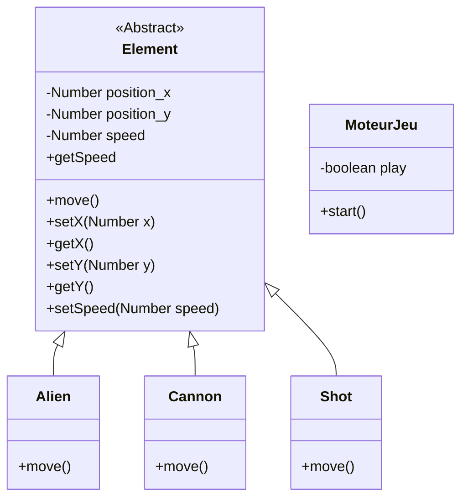

# Documentation du projet

Pour le moment, ce document est en cours de rédaction. Il ne contient pas beaucoup d'informations et sera complété au fur et à mesure du développement du jeu.

La documentation du code Java sera automatiquement générée. Cette documentation se concentrera sur la partie logique métier et fonctionnement du code $i.e.$ les réflexions et décisions que l'on a pris pour réaliser le jeu.

## Logique du jeu

Deux joueurs à l'extrémité de l'écran.
Aliens au milieu.
Joueurs sont représentés par des canons, ils peuvent tirer sur les aliens.

### Aliens

Armadas d'aliens : nombre d'aliens générés à déterminer. (en fonction de la taille de l'écran et de la taille d'un alien ?)
Déplacement : droite vers gauche, descente d'une rangée lorsque l'un des côtés est atteint, en direction du joueur.

Deux types d'armadas : une dirigée vers le bas et une dirigée vers le haut. Même mécanisme pour les deux, déplacement miroir.

### Canons

Les canons représentent les joueurs. Il y en a 2 dans notre version.
Déplacement: uniquement horizontal.

### Tirs

Les tirs sont uniquement possibles verticalement.
Aliens et joueurs peuvent tirer.

Règles pour les tirs :

- tir de joueur :
  - touche alien : alien et son tir sont détruits. Possibilité de toucher les deux types d'armadas (haut ou bas)
  - touche canon autre joueur : canon et son tir sont détruits.
  - touche missile d'un alien : les deux sont détruits.
- missile alien :
  - touche canon joueur : canon et missile sont détruits.

### Fin de partie

Fin de partie si une de ces situations se produit:

- aliens envahissent un joueur : la rangée d'aliens est au même niveau que le canon du joueur.
- un canon joueur est détruit.
- tous les aliens sont détruits.

## Modélisation du projet

Modélisation du projet

