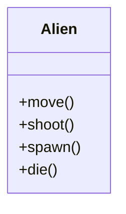
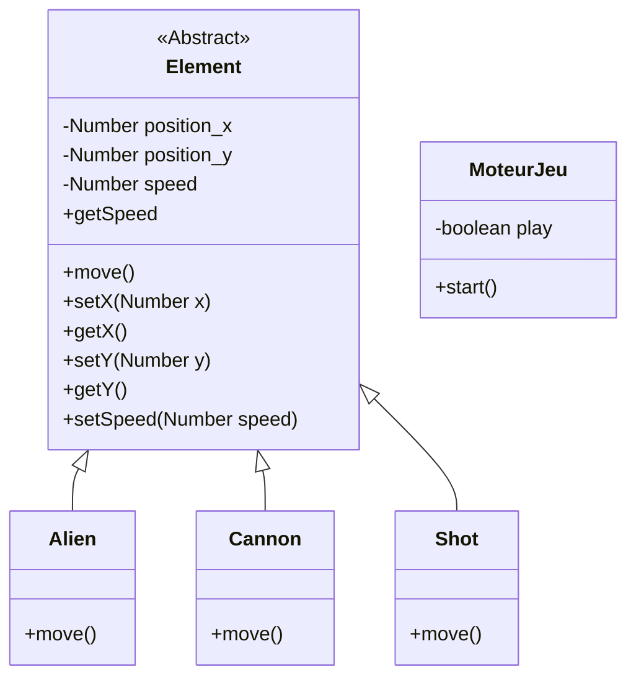
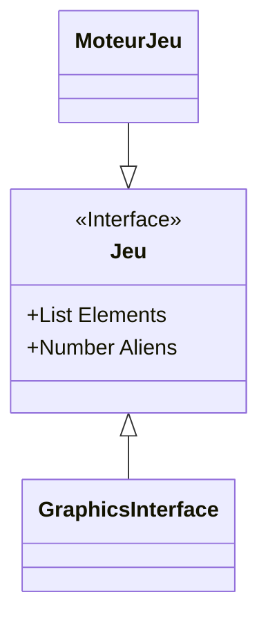

# Documentation du projet

Pour le moment, ce document est en cours de rédaction. Il ne contient pas beaucoup d'informations et sera complété au fur et à mesure du développement du jeu.

La documentation du code Java sera automatiquement générée. Cette documentation se concentrera sur la partie logique métier et fonctionnement du code $i.e.$ les réflexions et décisions que l'on a pris pour réaliser le jeu.

## Nouvelle organisation du projet

Après de multiples réflexions, nous avons décidé de changer l'organisation du projet. Ainsi, vous trouverez ci-dessous la définition de la nouvelle organisation.

Le projet est composé de 3 packages principaux :

- [Component](#package-component): Définit toutes les classes des différents éléments avec leur caractéristiques individuelles.
- [Core](#package-core): Définit les interactions entre les components notamments les collisions.
- [Game](#package-game): Définit le déroulé d'une partie et l'initialise.

### Package Component

Ce package est composé des classes suivantes :

- Alien
- Player
- Bullet
- EnemyShoot

Exemple :

:warning: Il faut définir la vie du player.

### Package Core

Ce package est composé des classes suivantes, qui définissent les collisions possibles :

- Alien_Player
- Bullet_Alien
- EnemyShoot_Player
- (...)

A chaque collision, soit la vie du player diminue, soit l'alien disparaît. (dépend de nos choix de conception et de nos règles de jeu)

### Package Game

Ce package est composé des classes suivantes :

- Page d'accueil
  - Jouer
  - Règles du jeu
  - A propos
- Initialisation du plateau avec Alien et Player.
- Définition de la fin de partie
  - Vie du player à 0
  - 0 Alien
  - Alien touche la ligne du player

## Logique du jeu

Deux joueurs à l'extrémité de l'écran.
Aliens au milieu.
Joueurs sont représentés par des canons, ils peuvent tirer sur les aliens.

### Aliens

Armadas d'aliens : nombre d'aliens générés à déterminer. (en fonction de la taille de l'écran et de la taille d'un alien ?)
Déplacement : droite vers gauche, descente d'une rangée lorsque l'un des côtés est atteint, en direction du joueur.

Deux types d'armadas : une dirigée vers le bas et une dirigée vers le haut. Même mécanisme pour les deux, déplacement miroir.

### Canons

Les canons représentent les joueurs. Il y en a 2 dans notre version.
Déplacement: uniquement horizontal.

### Tirs

Les tirs sont uniquement possibles verticalement.
Aliens et joueurs peuvent tirer.

Règles pour les tirs :

- tir de joueur :
  - touche alien : alien et son tir sont détruits. Possibilité de toucher les deux types d'armadas (haut ou bas)
  - touche canon autre joueur : canon et son tir sont détruits.
  - touche missile d'un alien : les deux sont détruits.
- missile alien :
  - touche canon joueur : canon et missile sont détruits.

### Fin de partie

Fin de partie si une de ces situations se produit:

- aliens envahissent un joueur : la rangée d'aliens est au même niveau que le canon du joueur.
- un canon joueur est détruit.
- tous les aliens sont détruits.

## Modélisation du projet

Modélisation du projet

Notre objectif est de séparer la partie logique de la partie graphique. Pour cela, on va donc devoir faire en sorte que le moteur de jeu, représenté par la classe `MoteurJeu`, renvoie les informations ou objets, à chaque opération effectuée, vers l'interface graphique afin que cela soit utilisable.

Pour cela, on peut envisager créer une interface entre le moteur de jeu et l'interface visuelle ?

L'interface `Jeu` est un contrat entre le moteur du jeu et l'interface graphique. Ainsi, cela permet de certifier que l'interface graphique a accès à toutes les informations du moteur de jeu et inversement.

A voir si le nombre d'aliens est utile car on pourrait le calculer à partir de la liste des éléments de la partie en cours. C'est une première proposition qui nécessite plus de réflexions.

## Tests

### Comment tester toutes les fonctionnalités du code ?

Il existe plusieurs types de tests. Nous allons au maximum essayer d'appliquer une stratégie de TDD : Test-Driven Development.
Une vidéo simple (en anglais) permet d'expliquer ce concept [ici](https://www.youtube.com/watch?v=Jv2uxzhPFl4&pp=ugMICgJmchABGAE%3D), même si c'est dans un autre langage (Javascript en l'occurrence), le concept des tests est le même.

D'abord, on va réaliser des tests unitaires sur toutes les classes.

Par exemple, on peut tester les cas des limites de jeu. Ainsi, un élément ne peut pas se déplacer hors du jeu, selon les contraintes de ces déplacements.
La gestion des limites de position se gère donc dans les setters de ces derniers, en vérifiant avant assignation, que les nouvelles coordonnées sont bien dans les limites du plateau de jeu (ou fenêtre de jeu ici).
